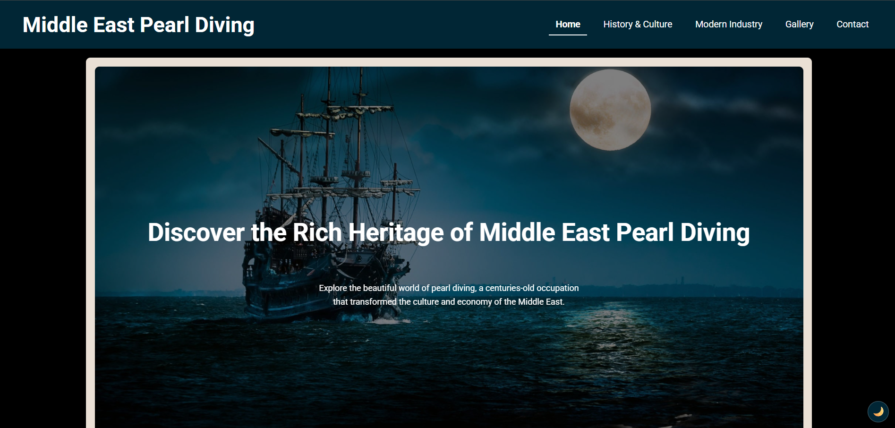
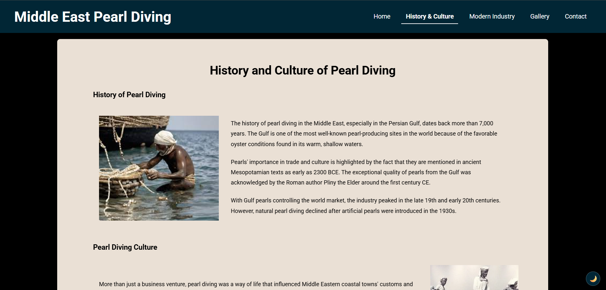
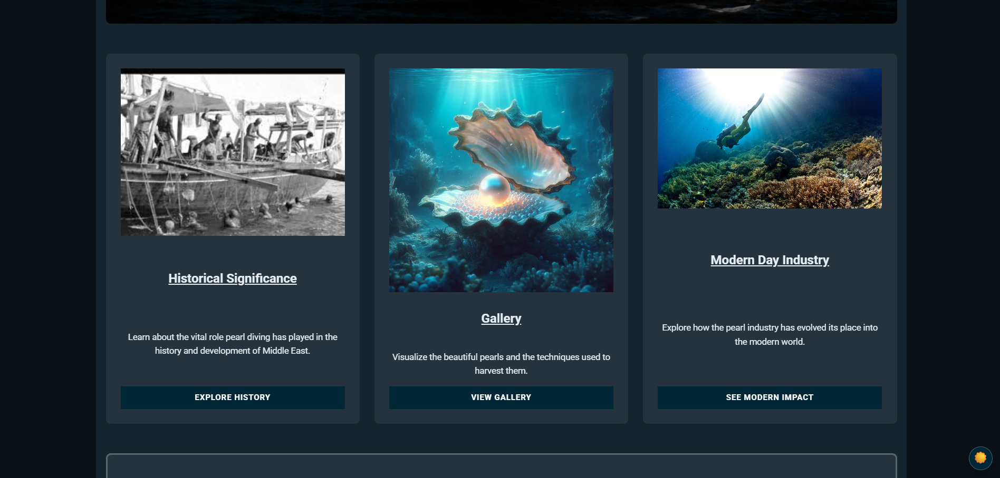
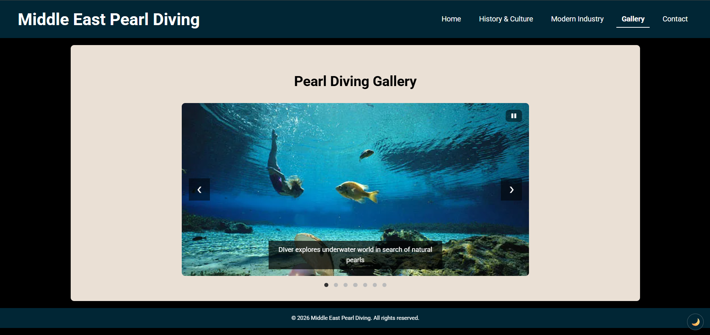

# Middle East Pearl Diving

> A responsive multimedia website about the heritage of pearl diving in the Gulf. It tells the story of a centuries-old trade through history, culture, the modern industry, and a photo gallery.


Live site: https://joeln45.github.io/middle-east-pearl-diving/

## About

Middle East Pearl Diving is a small virtual museum about a trade that shaped the
economy and culture of nations such as the UAE, Bahrain, Kuwait and Qatar before
it declined in the 1930s. The site covers the history and culture, the modern
industry, and a gallery of historic and contemporary images.

It began as coursework for CSCU9X5 UX Design at the University of Stirling and has
since been reworked into a portfolio piece: cleaner code, real tooling, an
accessibility pass, a working contact form, a few standout features, and a
performance and SEO pass. The design thinking behind it is written up in the
[case study](docs/CASE-STUDY.md).

## Screenshots

| Home                                          | History & Culture                                         |
| --------------------------------------------- | --------------------------------------------------------- |
|  |  |

| Dark mode                                                 | Gallery lightbox                                           |
| --------------------------------------------------------- | ---------------------------------------------------------- |
|  |  |

## Features

- Responsive, multi-page layout: Home, History & Culture, Modern Industry, Gallery, Contact
- Accessible navigation with a mobile hamburger menu
- Light and dark mode that remembers your choice and applies before the page paints
- Image gallery with an auto-advancing, keyboard-accessible carousel
- Full-screen gallery lightbox with keyboard and focus support
- Scroll-reveal animations, disabled for users who prefer reduced motion
- Interactive Leaflet map of the historic Gulf pearling nations
- Contact form with inline validation and Formspree submission
- WebP images, lazy-loading, and per-page SEO and social-share tags

## Tech stack

- HTML5 with semantic markup
- CSS3 with custom properties (a two-tier design-token system), Flexbox and Grid
- Vanilla JavaScript, no frameworks
- [Leaflet](https://leafletjs.com/) for the interactive map
- [Google Fonts](https://fonts.google.com/) (Roboto)
- Tooling: Prettier, Stylelint, and [sharp](https://sharp.pixelplumbing.com/) for image optimisation

## Project structure

```
middle-east-pearl-diving/
├─ index.html, history-culture.html, techniques.html, gallery.html, contact.html
├─ 404.html
├─ css/styles.css          design tokens, layout, dark theme, lightbox, map
├─ js/
│  ├─ theme.js             no-flash dark mode init (loaded in <head>)
│  ├─ components.js        injects the shared header and footer
│  ├─ script.js            nav, theme toggle, form, carousel, lightbox, scroll-reveal
│  └─ map.js               Leaflet map of the pearling nations
├─ images/                 photos plus their WebP versions
├─ scripts/optimize-images.mjs
├─ docs/CASE-STUDY.md
├─ sitemap.xml, robots.txt
└─ tooling configs (.editorconfig, .prettierrc.json, .stylelintrc.json, ...)
```

## Getting started

```bash
git clone https://github.com/joeln45/middle-east-pearl-diving.git
cd middle-east-pearl-diving
npm install
```

Then open `index.html` in a browser, or use the Live Server VS Code extension
(right-click `index.html`, then Open with Live Server) for auto-refresh while
editing. `npm install` is only needed for the tooling below, not to view the site.

## Scripts

| Command                   | What it does                                         |
| ------------------------- | ---------------------------------------------------- |
| `npm run format`          | Format all files with Prettier                       |
| `npm run format:check`    | Check formatting without writing                     |
| `npm run lint:css`        | Lint the CSS with Stylelint                          |
| `npm run optimize:images` | Regenerate WebP images and recompress the heavy ones |

The image script reads the originals in `images/`, writes a WebP version of each
photo, and keeps it only when it is smaller than the original. The in-place
recompression step is lossy, so only run it on known-good originals.

## Accessibility

The site targets WCAG 2.1 AA. That includes a skip link, keyboard-accessible
navigation and carousel, visible focus rings, descriptive alt text, high colour
contrast, and respect for the reduced-motion setting.

## Performance and SEO

Each page has a unique title and meta description, plus Open Graph and Twitter
card tags for link previews. Images below the fold are lazy-loaded and served as
WebP through `<picture>` where that is smaller. There is a `sitemap.xml` and a
`robots.txt` for crawlers.

## Roadmap

- [x] Project structure and tooling (Prettier, Stylelint)
- [x] Shared header and footer component
- [x] CSS design-token system
- [x] Accessibility pass (WCAG 2.1 AA)
- [x] Working contact form (Formspree) with validation
- [x] Dark mode, gallery lightbox, scroll animations, interactive map
- [x] Performance and SEO (image optimisation, meta tags)
- [x] Full docs and design case study
- [x] Live deployment (GitHub Pages) and CI

## Author

Joel Nirmal. University of Stirling, CSCU9X5 UX Design.

## License

Released under the [MIT License](LICENSE).
